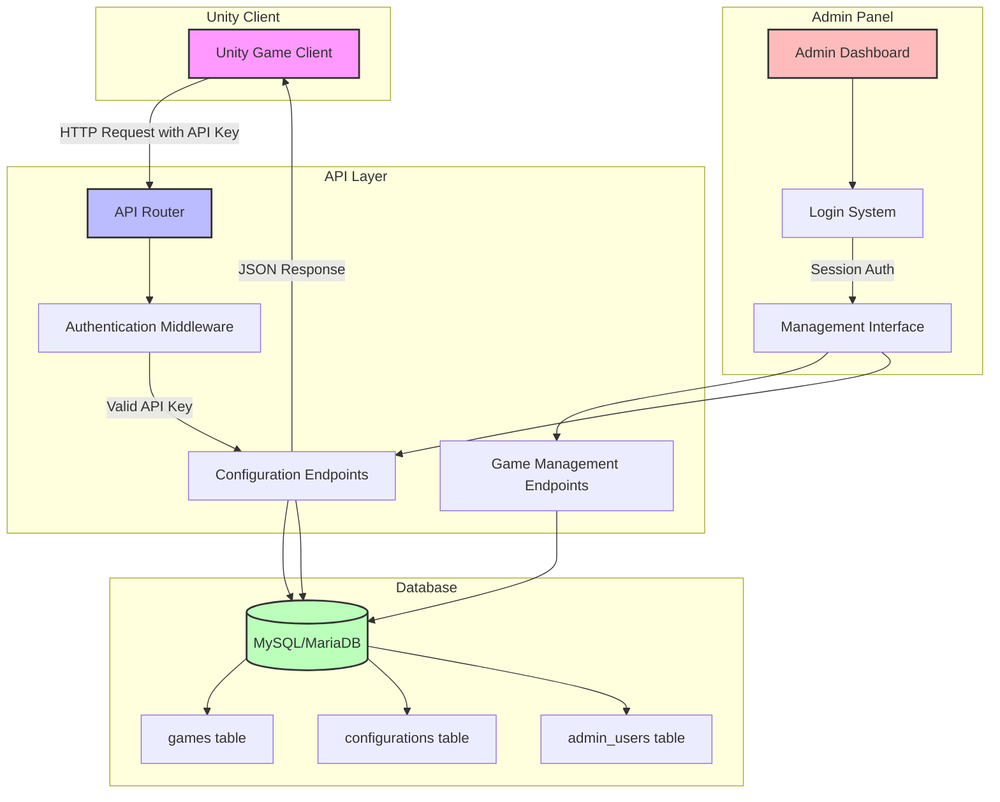
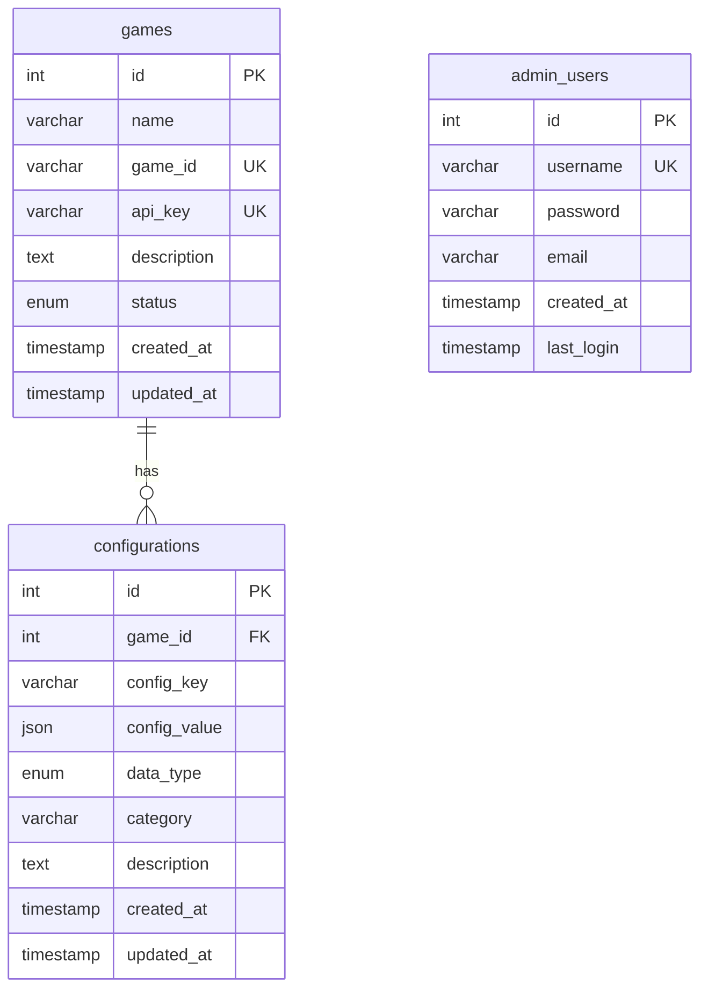

# Implementation Plan - Game Configuration API

## System Flowchart



## Database Schema Details

### Entity Relationship Diagram



## Implementation Steps

### Step 1: Database Setup
1. Create MySQL/MariaDB database
2. Execute schema.sql to create tables
3. Create indexes for performance optimization
4. Set up foreign key constraints

### Step 2: Core Configuration Files
1. Database connection class
2. Configuration management
3. Error handling utilities
4. Response formatting helpers

### Step 3: API Authentication
1. API key validation middleware
2. Rate limiting implementation
3. CORS configuration
4. Input sanitization

### Step 4: API Endpoints
1. Configuration retrieval endpoints
2. Game management endpoints
3. Admin endpoints for management
4. Error handling and response formatting

### Step 5: Admin Panel
1. Login/logout system
2. Dashboard with overview
3. Game management interface
4. Configuration management interface

### Step 6: Security & Validation
1. Input validation for all endpoints
2. SQL injection prevention
3. XSS protection
4. Secure session management

### Step 7: Documentation & Deployment
1. API documentation for Unity developers
2. Deployment guide for cPanel
3. Sample Unity integration code
4. Testing procedures

## API Endpoint Specifications

### Configuration Retrieval

#### GET /api/v1/config/{game_id}
**Purpose**: Retrieve all configurations for a specific game
**Authentication**: Required (API Key)
**Parameters**:
- `game_id` (path): Unique identifier for the game

**Response Example**:
```json
{
    "success": true,
    "data": {
        "state.maintenanceMode": false,
        "state.pvpEnabled": true,
        "config.maxPlayersPerMatch": 10,
        "config.experienceMultiplier": 2.0,
        "list.enabledLevels": ["level_1", "level_2"],
        "data.economyRates": {
            "gold_to_gems": 100,
            "gems_to_premium": 10
        }
    },
    "meta": {
        "version": "1.0.0",
        "timestamp": "2025-01-15T10:30:00Z",
        "game_id": "sample_game"
    }
}
```

#### GET /api/v1/config/{game_id}/{key}
**Purpose**: Retrieve a specific configuration key
**Authentication**: Required (API Key)
**Parameters**:
- `game_id` (path): Unique identifier for the game
- `key` (path): Configuration key to retrieve

#### GET /api/v1/config/{game_id}/category/{category}
**Purpose**: Retrieve configurations by category
**Authentication**: Required (API Key)
**Parameters**:
- `game_id` (path): Unique identifier for the game
- `category` (path): Category of configurations

### Game Management (Admin)

#### POST /api/v1/admin/games
**Purpose**: Create a new game
**Authentication**: Required (Admin Session)
**Request Body**:
```json
{
    "name": "New Game",
    "game_id": "new_game_001",
    "description": "Description of the new game"
}
```

**Response Example**:
```json
{
    "success": true,
    "data": {
        "id": 1,
        "name": "New Game",
        "game_id": "new_game_001",
        "api_key": "generated_api_key_here",
        "status": "active"
    }
}
```

#### PUT /api/v1/admin/games/{id}
**Purpose**: Update game details
**Authentication**: Required (Admin Session)

#### DELETE /api/v1/admin/games/{id}
**Purpose**: Delete a game
**Authentication**: Required (Admin Session)

### Configuration Management (Admin)

#### POST /api/v1/admin/config
**Purpose**: Add or update configuration
**Authentication**: Required (Admin Session)
**Request Body**:
```json
{
    "game_id": 1,
    "config_key": "config.newSetting",
    "config_value": 100,
    "data_type": "number",
    "category": "config",
    "description": "Description of the setting"
}
```

#### DELETE /api/v1/admin/config/{id}
**Purpose**: Delete configuration
**Authentication**: Required (Admin Session)

## Error Codes

| Error Code | HTTP Status | Description |
|------------|-------------|-------------|
| INVALID_API_KEY | 401 | The provided API key is invalid |
| GAME_NOT_FOUND | 404 | The specified game ID doesn't exist |
| CONFIG_NOT_FOUND | 404 | The specified configuration key doesn't exist |
| INVALID_INPUT | 400 | The request contains invalid data |
| RATE_LIMIT_EXCEEDED | 429 | Too many requests from this IP |
| INTERNAL_ERROR | 500 | Server internal error |

## Security Implementation Details

### API Key Validation
```php
function validateApiKey($apiKey) {
    // Hash the provided key to compare with stored hash
    $hashedKey = hash('sha256', $apiKey);
    
    // Query database for matching hash
    $stmt = $pdo->prepare("SELECT id FROM games WHERE api_key = ?");
    $stmt->execute([$hashedKey]);
    
    return $stmt->fetch(PDO::FETCH_ASSOC) !== false;
}
```

### Rate Limiting
```php
function checkRateLimit($ip, $limit = 100, $window = 60) {
    // Simple file-based rate limiting
    $rateFile = "rate_limits/{$ip}.json";
    $now = time();
    
    if (file_exists($rateFile)) {
        $data = json_decode(file_get_contents($rateFile), true);
        
        // Reset if window has passed
        if ($now - $data['reset_time'] > $window) {
            $data = ['count' => 0, 'reset_time' => $now];
        }
        
        // Check limit
        if ($data['count'] >= $limit) {
            return false;
        }
        
        $data['count']++;
    } else {
        $data = ['count' => 1, 'reset_time' => $now];
    }
    
    file_put_contents($rateFile, json_encode($data));
    return true;
}
```

## Performance Considerations

### Database Optimization
1. Index on `games.api_key` for fast authentication
2. Index on `configurations.game_id` for quick lookups
3. Index on `configurations.config_key` for specific key retrieval
4. Composite index on `(game_id, config_key)` for unique constraint

### Caching Strategy
1. Simple file-based caching for frequently accessed configurations
2. Cache invalidation when configurations are updated
3. Cache TTL of 5 minutes for balance between freshness and performance

### Response Optimization
1. Gzip compression for API responses
2. Minimal JSON structure to reduce payload size
3. Proper HTTP caching headers where appropriate

This implementation plan provides a clear roadmap for building a robust, secure, and performant game configuration API that meets your requirements for Unity game integration and cPanel hosting compatibility.